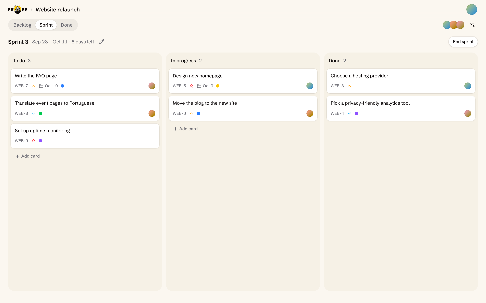
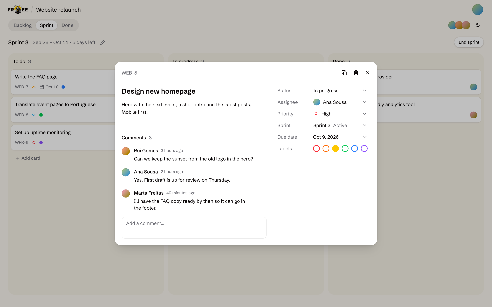
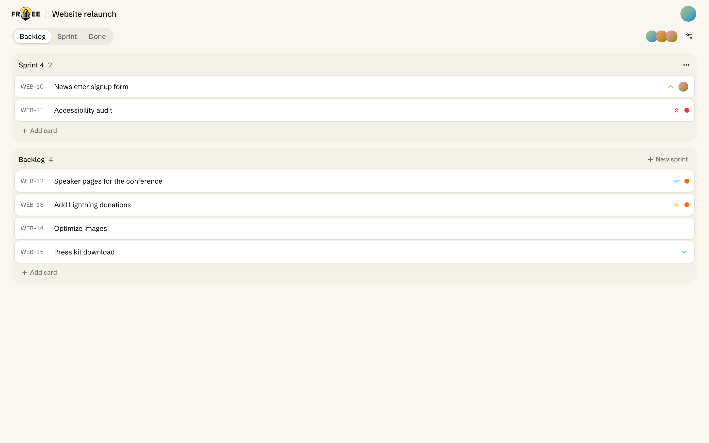
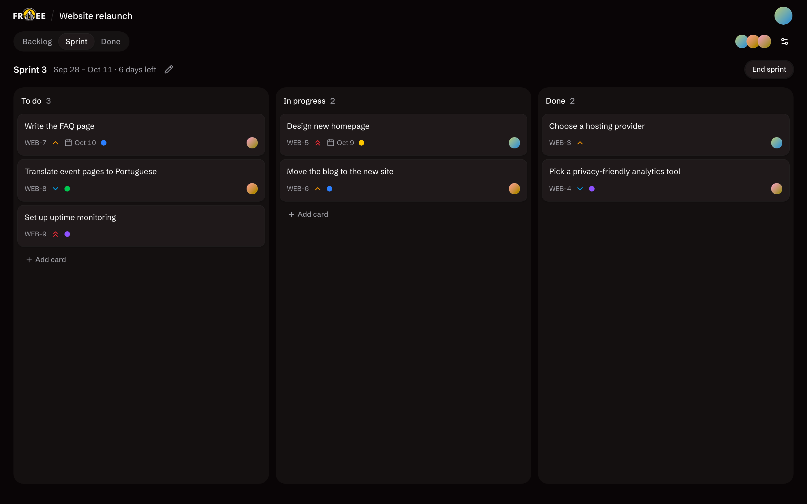
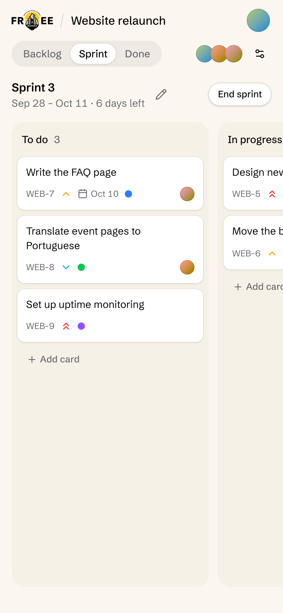

<div align="center">
<h1>Freehub</h1>
<p>Nostr-first project management, CRM, docs, files and maps</p>
</div>

Freehub is a team workspace with boards, CRM tables, docs, a Drive and a 3D map, and no backend or database. The app is a static site: every change is a signed Nostr event sent to your team's private relay, and the relay's whitelist decides who gets in.

## Screenshots

<details>
<summary>Show screenshots</summary>

<br />











</details>

## Getting started

### Requirements

- [Node](https://nodejs.org/) 22+
- [pnpm](https://pnpm.io/installation)
- [nak](https://github.com/fiatjaf/nak), for a local test relay

### 1. Install

```bash
pnpm install
```

### 2. Start a local relay

```bash
nak serve --auth
```

Leave it running: it's an in-memory relay on `ws://localhost:10547` that requires AUTH, lets any key in and forgets everything when it stops. `public/config.json` points at it out of the box, so you can leave the config alone until you deploy.

### 3. Run

```bash
pnpm dev            # vite on http://localhost:5173
```

Log in with a Nostr browser extension or a signer app.

### Checks

```bash
pnpm typecheck      # type-check only
pnpm check          # oxlint and oxfmt, through ultracite
pnpm fix            # the same, fixing what it can
pnpm build          # type-check and build to dist/
pnpm preview        # serve the build on http://localhost:4173
```

## Guide

Running Freehub for your team, and how it works inside, are in the [guide](GUIDE.md):

- [Make it yours](GUIDE.md#make-it-yours) — the team relay, branding and who gets in
- [Configuration](GUIDE.md#configuration) — every field in `public/config.json`
- [Map](GUIDE.md#map) — baking a 3D world pack of your region
- [Drive](GUIDE.md#drive) — the Blossom server for project files
- [Deploy](GUIDE.md#deploy) — Coolify, Docker Compose or a static host
- [Connectors](GUIDE.md#connectors) — feeding a store's orders into CRM tables
- [How it works](GUIDE.md#how-it-works) — projects, boards, CRM, docs, saving and loading
- [Events](GUIDE.md#events) — the Nostr kinds and tags
- [Project layout](GUIDE.md#project-layout) — where things live in the code
- [Known limits](GUIDE.md#known-limits) — what doesn't work yet

## Tech stack

- [Vite](https://vite.dev/) — build tool and dev server
- [React](https://react.dev/) — UI library, with the [React Compiler](https://react.dev/learn/react-compiler)
- [Tailwind CSS](https://tailwindcss.com/) — styling
- [shadcn/ui](https://ui.shadcn.com/) — component library, on [Base UI](https://base-ui.com/)
- [TanStack Table](https://tanstack.com/table) — the CRM's sorting, filtering, selection and paging
- [Motion](https://motion.dev/) — animations
- [dnd-kit](https://dndkit.com/) — drag and drop
- [three.js](https://threejs.org/) — the 3D map, with [postprocessing](https://github.com/pmndrs/postprocessing) for its night glow, [earcut](https://github.com/mapbox/earcut) for roofs and [vector-tile](https://github.com/mapbox/vector-tile-js) for its data
- [PDF.js](https://mozilla.github.io/pdf.js/) — thumbnails of PDFs, drawn in the browser on upload
- [Tiptap](https://tiptap.dev/) — the card description and doc page editor, on [ProseMirror](https://prosemirror.net/), with [marked](https://marked.js.org/) reading its Markdown
- [node-diff3](https://github.com/bhousel/node-diff3) — line diffs for merging edits of the same page
- [applesauce](https://github.com/hzrd149/applesauce) — Nostr event store, relay connections and signers
- [RxJS](https://rxjs.dev/) — streams from the event store
- [wouter](https://github.com/molefrog/wouter) — routing
- [date-fns](https://date-fns.org/) — dates
- [Sonner](https://sonner.emilkowal.ski/) — toasts
- [Caddy](https://caddyserver.com/) — static file server in the production image

## License

Released under the **MIT** license — see the [LICENSE](LICENSE) file for details.
